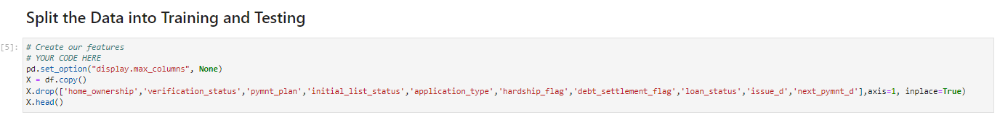
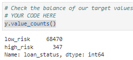
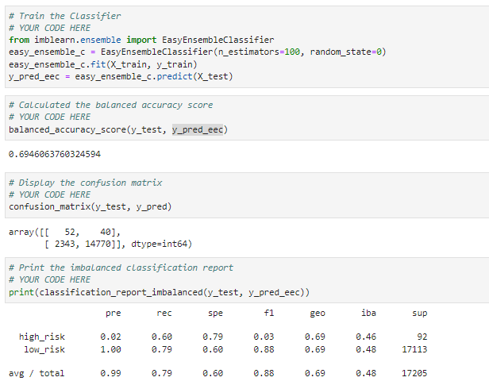
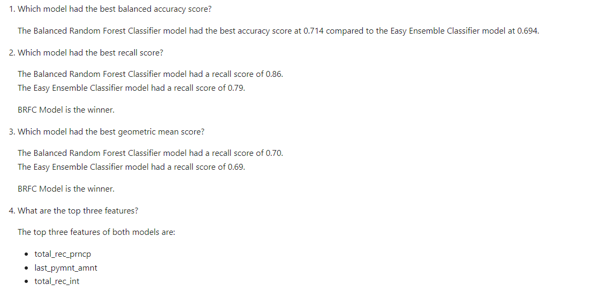

# Fintech-Machince-Learning

  

## Welcome to a Machine Learning  demonstration utilising:
- Naive Random Oversampler and Smote Algorithms
- Under Sampling using Cluster Centroids Algorithm
- [Imbalanced-learn](https://imbalanced-learn.org/stable/)
- [scikit-learn](https://scikit-learn.org/stable/)

Below is the results of an ensemble classifer to predict  loan risk.
The second example will bee found in the kernl in the code folder called [credit_risk_resample](https://github.com/muramemory/Fintech-Machine-Learning/blob/main/Code/credit_risk_resampling.ipynb).  
## Overview/Example

### Credit Risk Ensemble    
1. Split Data & Train Y value    
  
  

2. Balanced Random Forest Classifier    
  

3. Easy Ensemble Classifier  
  

4. Conclusion  
  

