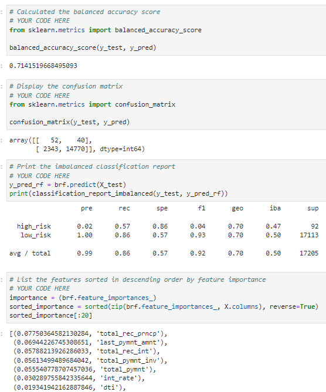

# Fintech-Machince-Learning
Welcome to a Machine Learning  demonstration utilising:
- Naive Random Oversampler and Smote Algorithms
- Under Sampling using Cluster Centroids Algorithm
- [Imbalanced-learn](https://imbalanced-learn.org/stable/)
- [scikit-learn](https://scikit-learn.org/stable/)

## Overview/Example

## Credit Risk Ensemble    
1. Split Data & Train Y value  
  
  

2. Balanced Random Forest Classifier  
  

3. Easy Ensemble Classifier  
  

4. Conclusion
  

